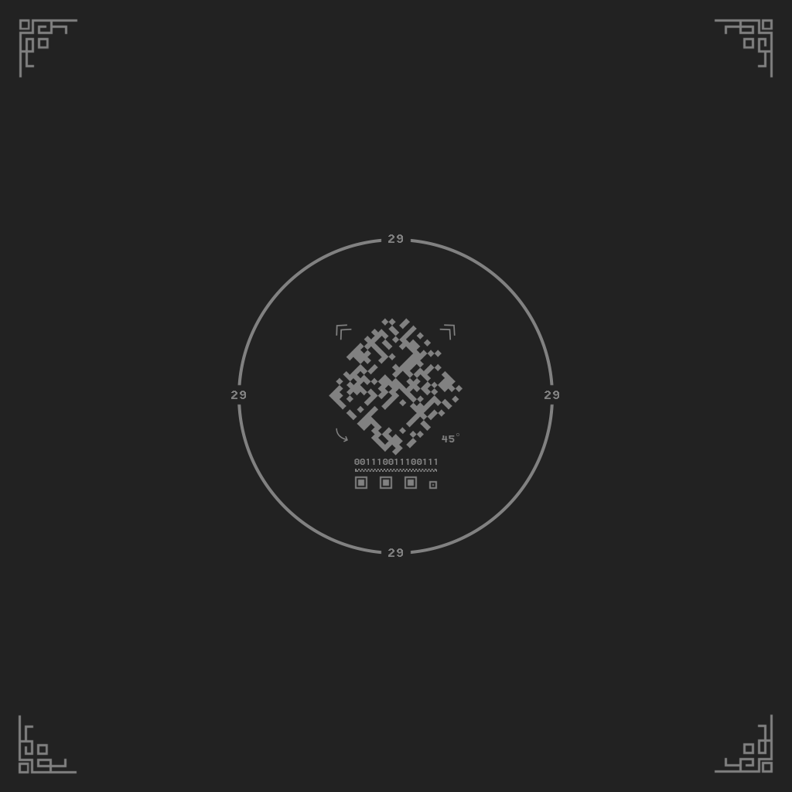
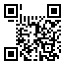
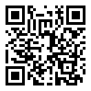

# The Mooncake Box

## Question Text

It is said that steganography was first discovered within the intricate designs baked onto mooncakes. The Chinese made used of this technique during the China-Mongolia war by using mooncakes as their inconspicuous medium of communication.

Mid-Autumn arrives yet again. You can't help to notice a sleek, dark mooncake box lying on the dining table. The design puzzles you. Is that a QR code? Are those binary digits?? Are they trying to promote their mooncake brand's website, or am I missing something?

Created by Optixal (Shawn Pang)

>

## Distribution
* "mooncake_box_design.png"

## Solution
1. It is a QR reconstruction challenge. To solve the puzzle, one must understand all clues provided and piece the information together into the form of a reconstructed QR code.
    * Clue 1: Four 29s
        * Four represents four sides of a QR code, 29 being the length of each side, meaning the QR code should be 29px by 29px, a version 3 QR code (refer to 3rd recommended read)
    * Clue 2: Arrows pointing to the north-west and north-east
        * The QR code is incomplete and has missing information. One should reconstruct the QR code outwards in those directions.
    * Clue 3: Curved arrows
        * The QR code needs to be rotated in an anti-clockwise direction
    * Clue 4: 001110011100111
        * The "format" information of the QR code. Representing an error correction encoding level of 'H' for high (30% recovery) and mask pattern 2 (refer to 2nd recommended read). Since GCTF is tuned down for juniors, fully understanding QR versioning, formatting and masking is not required for this challenge. You'll only have to understand that the binary digits are part of "QR code formatting", something that is crucial when reconstructing QR codes.
    * Clue 5: Dashes beneath binary digits
        * The missing "timing" information of the QR code. (refer to 1st recommended read)
    * Clue 6: Three medium boxes and one small box
        * The missing "positioning" and "alignment" boxes within the QR code. (refer to 4th recommended read)
2. With clues given from the outward arrows and curved arrows, we can assume that the bottom of the given QR code (the part nearly touching the digits) is the bottom-right of the final QR code. Redraw the QR code given on a fresh canvas (minimum 29px in width and length) within photoshop or gimp using 1x1 pixel pencil or brush in the proper orientation. 
3. The easiest is to first fill in the 3 positioning boxes in the corners and single alignment box within the missing space of the given QR. (refer to 4th recommended read)
4. Fill in the "dashed" timing information. (refer to 4th recommended read)
5. Fill in the formatting information around the positioning boxes. (refer to 1st recommended read)
6. Scan it to receive the flag `GCTF{54L73d_3gG_Y0LkZ}`.

>

Well-versed students may use tools to apply the Reed-Solomon error recovering techniques to fully reconstruct the QR code. One written in Python may be found here: https://github.com/tomerfiliba/reedsolomon The current challenge is already tedious, using the tool is unnecessary as you do not need to recover 100% of the QR code (since the format information shows it has a "High" ECC level) and you **may** spend even more time on the challenge.

>

## Recommended Reads
* http://www.thonky.com/qr-code-tutorial/format-version-information
* http://www.thonky.com/qr-code-tutorial/format-version-tables
* http://www.qrcode.com/en/about/version.html
* http://datagenetics.com/blog/november12013/index.html
